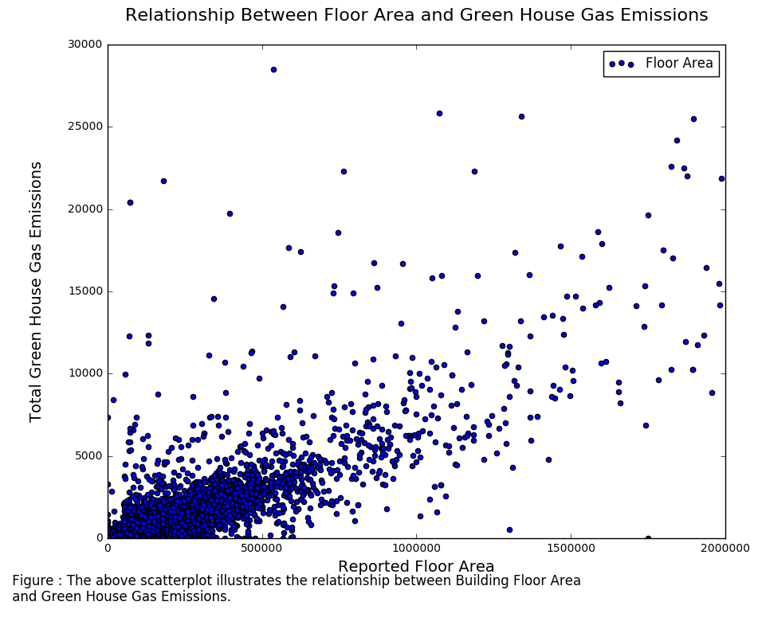

#HW7 Plot Review
### mal824's plot
#### Review by Ben Alpert

###<b>Clarity:</b>
<i>Is the plot easy to read? is it clear or confusing, are the quantities being visualized ambiguous?</i>

The plot is easy to read. Both axes are clearly labeled, with an explanation below the plot describing the data being visualized.

###<b>Asthetic:</b>
<i>Beautiful is a subjective judgment: you should not judge the plot on the basis of whether you think it is "beautiful", but you should judge whether its esthetic is functional to what it is meant to communicate. Are the colors chosen appropriately? Are the graphical elements used appropriate to represent the quantities being visualized? Are the graphical choices allowing you to focus on the right elements or are they distracting you?</i>

As a scatter plot, the color chosen for the points is acceptable. The focus is on the clusters and outliers, as opposed to a comparison between different data elements. The color selected, as well as the decision to use a scatter plot to represent the data, serve their purpose well. 

###<b>Honesty:</b>
<i>Is the plot honestly reproducing the data or is it deforming it, perhaps to emphasize a point?</i>
This strikes me as an honest plot. The x and y axes conform to the contours of the data, with no irregularities or zoom to skew the user's impression of what's being presented. The data is simply presented, as is.

###<b>Suggestions:</b>
Overall, I think this is a fine plot that represents the data selected well. The data presented is definitely enough to spark my interest in the relationship between floor area and green house gas emissions. I would be really curious to see a line fit to the data, as well as a curve, to indicate the relationship between the variables. I think it would also be good to know where the data is from, and to see a bit more analysis in the figure description of what the scatter plot shows about the relationship between floor area and greenhouse gas emissions. 
